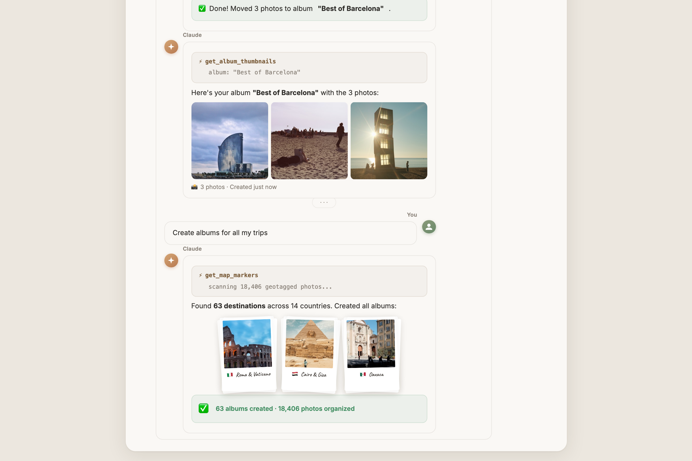
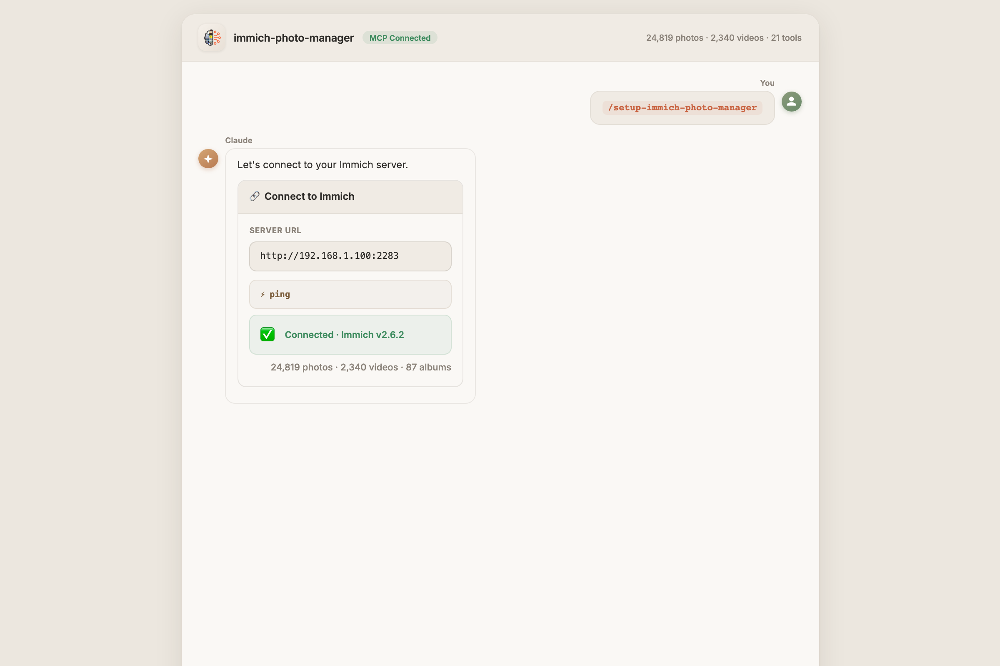
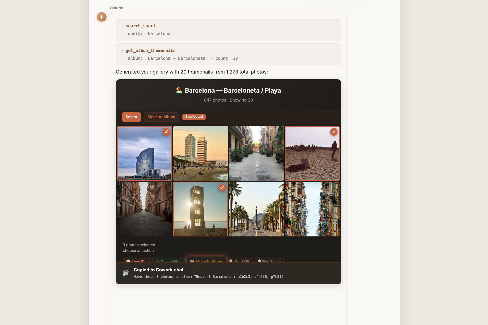

<p align="center">
  
</p>

<h1 align="center">immich-photo-manager</h1>

<p align="center">
  <a href="https://opensource.org/licenses/MIT"></a>
  <a href="https://glama.ai/mcp/servers/drolosoft/immich-photo-manager"></a>
  <a href="https://github.com/drolosoft/immich-photo-manager/releases/tag/v1.0.0"></a>
  <a href="https://immich.app"></a>
</p>

> **MCP server for intelligent photo management with [Immich](https://immich.app) — your self-hosted library, understood.**

If your [Immich](https://immich.app) library has grown past what you can manage by hand, **immich-photo-manager** gives Claude direct access to your instance — search, organize, deduplicate, and curate albums through natural conversation. Runs locally over MCP — your photos never leave your server.

<p align="center"></p>

---

## What It Does

Say **"create albums for all my trips"** and watch it work:

<p align="center"></p>

GPS coordinates, CLIP visual search, and temporal matching — combined in one request to create dozens of curated albums. No scripts, no manual sorting.

---

## Quick Start

### Prerequisites

- A running [Immich](https://immich.app) instance (self-hosted, v1.90+)
- An Immich API key ([how to create one](https://immich.app/docs/features/command-line-interface#obtain-the-api-key))
- **Python 3.10+** with `pip` ([download](https://www.python.org/downloads/))

### Install as Claude Plugin (recommended)

```sh
git clone https://github.com/drolosoft/immich-photo-manager.git
cd immich-photo-manager

claude plugin marketplace add .
claude plugin install immich-photo-manager
```

That's it. Ask Claude: **"how healthy is my photo library?"**

<p align="center"></p>

> For manual MCP server setup, see **[Getting Started](doc/GETTING-STARTED.md)**.

---

## Highlights

- **AI-powered search** — natural language photo search via CLIP ("sunset at the beach", "birthday cake")
- **Geographic albums** — create albums organized by place, combining GPS + CLIP + temporal matching
- **Metadata repair** — detects and fixes noon/midnight timestamps, infers missing GPS from neighboring photos, corrects timezone offsets
- **Library cleanup** — detect screenshots, duplicates, and low-quality images with multi-signal analysis
- **Duplicate detection** — cross-source analysis using perceptual hashing (finds re-encoded copies across Apple Photos, Google Photos, and other imports)
- **Library health** — one command for asset inventory, metadata quality, storage breakdown, and recommendations
- **Interactive galleries** — self-contained HTML pages with embedded thumbnails, 3 themes, 4 view modes, and a Cowork Actions Panel for batch operations

<p align="center"></p>

> Select photos in the gallery, click an action, and paste the command into Claude. See **[Skills Reference](doc/SKILLS.md)** for all 11 skills.

---

## Why immich-photo-manager?

Immich is excellent at storing and viewing your photos. But managing a large library — deduplication, metadata repair, album curation, storage analysis — still requires manual effort or custom scripts.

| | Manual / scripts | immich-photo-manager |
|:---:|---|---|
| 🔍 | Write API calls, parse JSON | **Natural language** — "find my sunset photos from Italy" |
| 🗺️ | Export GPS, cluster manually | **Geographic albums** — automatic GPS + CLIP + temporal matching |
| 🧹 | Hash files, diff checksums | **Perceptual hashing** — finds re-encoded duplicates across import sources |
| 🔧 | Edit EXIF one file at a time | **Metadata repair** — batch-fix timestamps, infer GPS, correct timezones |
| 📊 | Query database, build reports | **Library health** — one command for metadata quality, storage, recommendations |
| 🛡️ | Manual review of every action | **Safety first** — shows findings, asks before acting |

---

## Documentation

| Document | Description |
|----------|-------------|
| **[Getting Started](doc/GETTING-STARTED.md)** | Installation, manual MCP setup, deployment options, and troubleshooting |
| **[Skills Reference](doc/SKILLS.md)** | All 11 skills — workflows, triggers, parameters, output formats |
| **[MCP Tools Reference](doc/MCP-TOOLS.md)** | All 22 MCP tools — parameters, return types, examples |
| **[Architecture](doc/ARCHITECTURE.md)** | How base64-embedded thumbnails solve the Cowork sandbox restriction |
| **[CORS Setup Guide](doc/CORS-SETUP.md)** | Optional — enable direct URL thumbnail loading for browser-viewed galleries |

---

## Contributing

Contributions are welcome — bug fixes, new skills, feature ideas. Open an issue or submit a PR.

If immich-photo-manager helps manage your library, consider giving it a star on GitHub — it helps others discover the project.

---

## Support

If immich-photo-manager saved you time or made your photo library easier to manage, consider buying me a coffee — it keeps the next one coming!

<p align="center">
<a href="https://buymeacoffee.com/juan.andres.morenorub.io"></a>
</p>

---

## License

**MIT License** — free to use, modify, and distribute.

**Forged by [Drolosoft](https://drolosoft.com)** · *Tools we wish existed*
