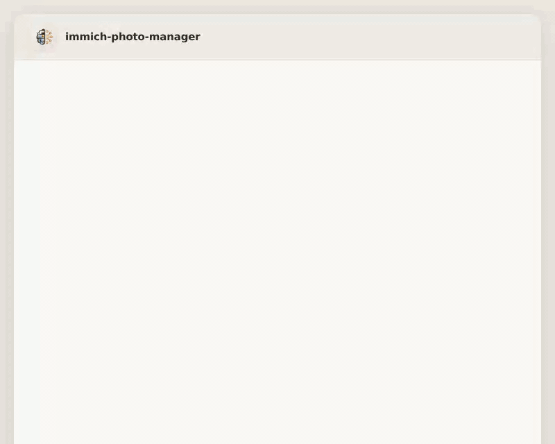

<p align="center">
  
</p>

<h1 align="center">immich-photo-manager</h1>

<p align="center">
  <a href="https://opensource.org/licenses/MIT"></a>
</p>

> **📸🧹🗺️ MCP server for intelligent photo management with [Immich](https://immich.app) — your self-hosted library, understood.**

If you self-host [Immich](https://immich.app) and your library has grown past the point where you can manage it by hand, **immich-photo-manager** gives Claude direct access to your Immich instance through 21 MCP tools and 11 specialized skills — from finding cross-ecosystem duplicates with perceptual hashing to generating interactive HTML galleries with a Cowork Actions Panel.

<p align="center"></p>

---

## 🚀 Quick Start

### Prerequisites

- A running [Immich](https://immich.app) instance (self-hosted, v1.90+)
- An Immich API key ([how to create one](https://immich.app/docs/features/command-line-interface#obtain-the-api-key))
- **Python 3.10+** with `pip` ([download](https://www.python.org/downloads/))

### Option A: Install as Claude Plugin (recommended)

```bash
# 1. Clone the repository
git clone https://github.com/drolosoft/immich-photo-manager.git
cd immich-photo-manager

# 2. Run the interactive setup (installs Python deps, configures MCP)
./scripts/setup-mcp.sh

# 3. Register the marketplace and install the plugin
claude plugin marketplace add ~/immich-photo-manager
claude plugin install immich-photo-manager

# 4. Restart Claude Code or start a new Cowork session, then verify:
claude -p "use the immich ping tool"
```

That's it. Open Claude and say **"how healthy is my photo library?"** to get started.

### Option B: Manual MCP Configuration

If you prefer to configure the MCP server manually instead of using the setup script:

```bash
git clone https://github.com/drolosoft/immich-photo-manager.git
cd immich-photo-manager
pip3 install -r src/requirements.txt
```

Create `.mcp.json` in the project root:

```json
{
  "mcpServers": {
    "immich": {
      "command": "python3",
      "args": ["-m", "immich_mcp_server"],
      "env": {
        "PYTHONPATH": "/ABSOLUTE/PATH/TO/immich-photo-manager/src",
        "MCP_TRANSPORT": "stdio",
        "IMMICH_BASE_URL": "https://your-immich-server.com",
        "IMMICH_API_KEY": "your-api-key-here"
      }
    }
  }
}
```

> **Important:** Use `PYTHONPATH` pointing to the `src/` directory. Do NOT use `cwd` (it is silently ignored by Claude Code).

> **Note on Smart Search (CLIP):** The `search_smart` tool requires the Immich machine learning service to be running and Smart Search enabled in **Administration > Settings > Machine Learning Settings > Smart Search**. If the ML service is not configured, the tool will return a helpful error message instead of failing silently. All other tools work without the ML service. See the [Immich Smart Search docs](https://immich.app/docs/features/smart-search) for setup details.

---

## 🎬 Core Workflow

```
You: "Create albums for all the places I've traveled"

→ Scans GPS data from 28,000+ photos
→ Clusters by location, identifies 47 destinations across 14 countries
→ Proposes album list for approval
→ Creates albums with curated selections (20-50 photos each)
→ Publishes to Gallery with shared links

✅ Created: 🇮🇹 Roma, Italia (47 photos, Jun 2023)
✅ Created: 🇪🇬 Cairo & Luxor, Egypt (63 photos, Mar 2024)
✅ Created: 🇲🇽 Oaxaca, México (38 photos, Dec 2022)
... 44 more albums
```

Geographic album creation combines GPS coordinates, CLIP visual search, and temporal matching — then filters out screenshots and duplicates automatically. One request, dozens of curated albums.

---

## ✨ Features

| | Feature | What it does |
|:---:|---------|-------------|
| 🔍 | **AI-powered search** | Natural language photo search via CLIP ("sunset at the beach", "birthday cake") |
| 🗺️ | **Geographic albums** | Create albums organized by place — GPS + CLIP combined for smart curation |
| 🧹 | **Library cleanup** | Detect screenshots, duplicates, and low-quality images with multi-signal analysis |
| 🔎 | **Duplicate report** | Deep cross-source duplicate analysis using perceptual hashing — finds re-encoded copies across Apple Photos, Google Photos, and other imports |
| 🏥 | **Library health** | Comprehensive health check — asset inventory, metadata quality, storage breakdown, and recommendations |
| 📅 | **Timeline gaps** | Find missing months, sparse periods, and single-source coverage risks in your photo timeline |
| 🔧 | **Metadata fixer** | Detect and repair broken dates (noon/midnight), missing GPS, wrong timezones — with neighbor interpolation |
| 📌 | **Auto-album curator** | Finds new photos that belong in existing albums using GPS, CLIP, and temporal matching |
| 💾 | **Storage optimizer** | Identify RAW+JPEG pairs, oversized videos, and other space hogs with reclaimable space estimates |
| 👥 | **People report** | Face recognition insights — who appears most, unnamed clusters worth naming, co-occurrence patterns |
| 🌍 | **Travel map** | Interactive Leaflet.js map with clustered pins showing every place you've photographed |
| 🔗 | **Gallery publishing** | Create shared links to make albums publicly accessible |
| 🖼️ | **Interactive HTML galleries** | Self-contained gallery pages with embedded thumbnails, 3 themes (light/system/dark), 5 view modes, slideshow, and keyboard navigation |
| 🎛️ | **Cowork Actions Panel** | Select photos in the gallery and copy batch commands (Create Album, Get EXIF, Find Similar, Download, etc.) straight into Cowork chat |
| 🛡️ | **Safety first** | Never deletes automatically — always shows findings and asks before acting |

---

## 🖼️ Interactive Gallery & Cowork Actions

Say **"show me photos from Barcelona"** and the plugin generates a self-contained HTML gallery — no server required, opens in any browser.

```
You: "Show me my Egypt album"

→ Fetches album + base64 thumbnails from Immich
→ Generates single-file HTML with embedded images
→ 3 themes (light/system/dark), 5 view modes, slideshow, keyboard nav
→ Cowork Actions Panel for batch operations

✅ egypt-album.html — open it, browse your photos, select & act
```

The **Cowork Actions Panel** is a sticky toolbar inside each gallery. Select photos, then click any action — the command is copied to your clipboard, ready to paste into Cowork chat:

| Action | What it copies |
|--------|---------------|
| 📋 Copy IDs | Raw asset IDs for scripting |
| ➕ Create Album | "Create a new album with these photos: ..." |
| 📂 Add to Album | "Add these photos to album [name]: ..." |
| 📦 Move to Album | "Move these photos to a different album: ..." |
| 🔍 Get EXIF Info | "Get EXIF metadata for these photos: ..." |
| 🔎 Find Similar | "Find visually similar photos to: ..." |
| 🖼️ Set as Cover | "Set this photo as the album cover: ..." |
| ⬇️ Download | "Download these photos: ..." |
| ❤️ Add to Favs | "Mark these photos as favorites: ..." |
| ⚠️ Remove from Album | "Remove these from album [name]: ..." |
| 🗑️ Delete Photos | "Delete these photos permanently: ..." |

The gallery is fully responsive, works offline once generated, and supports touch gestures on mobile.

---

## 🤔 Why immich-photo-manager?

Immich is excellent at storing, viewing, and searching your photos. But managing a large library — deduplication, metadata repair, album curation, storage analysis — still requires manual effort or custom scripts. immich-photo-manager bridges that gap.

| | Manual / scripts | immich-photo-manager |
|:---:|---|---|
| 🔍 | Write API calls, parse JSON | **Natural language** — "find my sunset photos from Italy" |
| 🗺️ | Export GPS, cluster manually | **Geographic albums** — automatic GPS + CLIP + temporal matching |
| 🧹 | Hash files, diff checksums | **Perceptual hashing** — finds re-encoded duplicates across import sources |
| 📊 | Query database, build reports | **Library health** — one command for metadata quality, storage, recommendations |
| 📅 | SQL queries on timestamps | **Timeline gaps** — detects empty months and single-source coverage risks |
| 🔧 | EXIF tools, manual review | **Metadata fixer** — neighbor interpolation for missing GPS, broken timestamps |
| 🛡️ | Hope you don't delete the wrong thing | **Safety first** — never deletes without showing findings and asking |

---

## 🧩 Skills

Skills are specialized workflows that combine MCP tools with domain knowledge. Each handles a specific photo management task end-to-end.

| Skill | What it does |
|-------|-------------|
| 🗺️ **Album Manager** | Create and curate albums organized by geography — GPS + CLIP + filtering |
| 🔍 **Photo Search** | Natural language search combining GPS, CLIP, and metadata filters |
| 🧹 **Photo Cleanup** | Detect screenshots, duplicates, and low-quality images with confidence levels |
| 🔎 **Duplicate Report** | Cross-source duplicate analysis using perceptual hashing (pHash) |
| 🏥 **Library Health** | Asset inventory, metadata completeness, storage breakdown, recommendations |
| 📅 **Timeline Gaps** | Detect empty months, sparse periods, single-source coverage risks |
| 🔧 **Metadata Fixer** | Repair broken dates, missing GPS, wrong timezones with neighbor interpolation |
| 📌 **Auto-Album Curator** | Find new photos that match existing albums using GPS, CLIP, and temporal patterns |
| 💾 **Storage Optimizer** | Identify RAW+JPEG pairs, oversized videos, reclaimable space estimates |
| 👥 **People Report** | Face recognition insights — top faces, unnamed clusters, co-occurrence patterns |
| 🌍 **Travel Map** | Interactive Leaflet.js map with clustered pins and heatmap overlay |

See the **[Skills Reference](doc/SKILLS.md)** for detailed workflows, triggers, and output formats.

---

## ⚙️ How It Works

```
Claude ←→ MCP (stdio) ←→ Python Server ←→ Immich REST API
                                              your-instance
```

The MCP server is a Python module (`immich_mcp_server`) that communicates with Claude over stdio transport. It exposes 21 tools that map to Immich REST API endpoints, with added intelligence for batch operations, thumbnail embedding, and credential management.

Gallery HTML files are fully self-contained — thumbnails are fetched from Immich, encoded as base64, and embedded directly in the HTML. This is required because the Cowork viewer runs in an `about:` sandbox that blocks all external network requests. See **[Architecture](doc/ARCHITECTURE.md)** for the full technical explanation.

### 21 MCP Tools

| Category | Tools |
|----------|-------|
| 🏥 Health (3) | `ping`, `get_server_version`, `get_statistics` |
| 📷 Assets (2) | `get_asset_info`, `get_map_markers` |
| 🔍 Search (2) | `search_metadata`, `search_smart` (CLIP) |
| 📁 Albums (7) | `list_albums`, `get_album`, `create_album`, `update_album`, `delete_album`, `add_assets_to_album`, `remove_assets_from_album` |
| 🔗 Sharing (2) | `list_shared_links`, `create_shared_link` |
| 🖼️ Thumbnails (3) | `get_asset_thumbnail`, `get_album_thumbnails`, `get_thumbnails_batch` |
| 🔧 Config (2) | `get_connection_info`, `update_credentials` |

See the **[MCP Tools Reference](doc/MCP-TOOLS.md)** for parameters, return types, and examples.

---

## 📚 Documentation

| Document | Description |
|----------|-------------|
| **[Getting Started](doc/GETTING-STARTED.md)** | Installation, configuration, deployment options, and troubleshooting |
| **[Architecture](doc/ARCHITECTURE.md)** | How base64-embedded thumbnails solve the Cowork sandbox restriction |
| **[Skills Reference](doc/SKILLS.md)** | All 11 skills — workflows, triggers, parameters, output formats |
| **[MCP Tools Reference](doc/MCP-TOOLS.md)** | All 21 MCP tools — parameters, return types, examples |
| **[CORS Setup Guide](doc/CORS-SETUP.md)** | Optional — enable direct URL thumbnail loading for browser-viewed galleries |

### Additional dependencies (optional)

Some advanced skills require Python packages or direct database access:

```bash
pip3 install Pillow imagehash pillow-heif
```

| Package | Used by | Purpose |
|---------|---------|---------|
| `Pillow` | duplicate-report | Image loading |
| `imagehash` | duplicate-report | Perceptual hashing (pHash) |
| `pillow-heif` | duplicate-report | HEIC/HEIF support (Apple Photos) |
| PostgreSQL client | library-health, timeline-gaps, people-report, storage-optimizer | Database-level analysis |

---

## 🤝 Contributing

Contributions are welcome. If you find a bug, have a feature idea, or want to improve a skill:

1. Fork the repository
2. Create a feature branch (`git checkout -b feature/my-feature`)
3. Commit your changes
4. Open a pull request

For bug reports and feature requests, use [GitHub Issues](https://github.com/drolosoft/immich-photo-manager/issues).

---

## ☕ Support

If immich-photo-manager saved you time or made your photo library easier to manage, consider buying me a coffee — it keeps the next one coming!

<p align="center">
<a href="https://buymeacoffee.com/juan.andres.morenorub.io"></a>
</p>

---

## 📜 License

**MIT License** — free to use, modify, and distribute.

**Forged by [Drolosoft](https://drolosoft.com)** · *Tools we wish existed*
